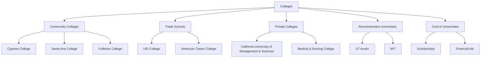

# Criteria for the Best College

## Table of Contents
1. [Location](#location)
2. [Cost](#cost)
3. [Scholarships](#scholarships)
4. [Accreditation](#accreditation)
5. [College Types](#college-types)

## Location
- Close to home area

## Cost
- How much money does the college cost

## Scholarships
- Percentage of scholarship given

## Accreditation
- Is the College/University ABET accredited?

## College Types
